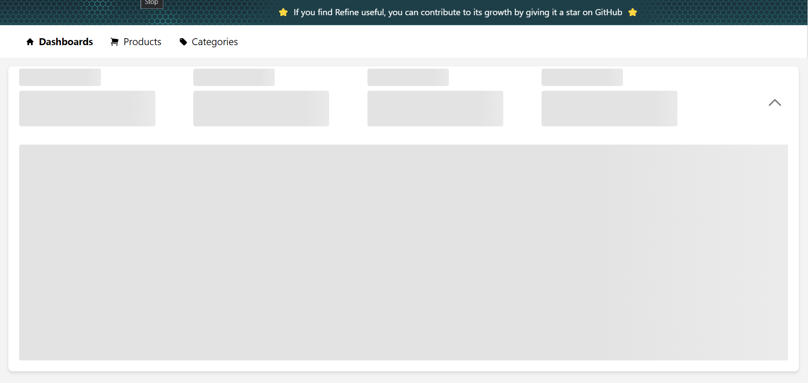
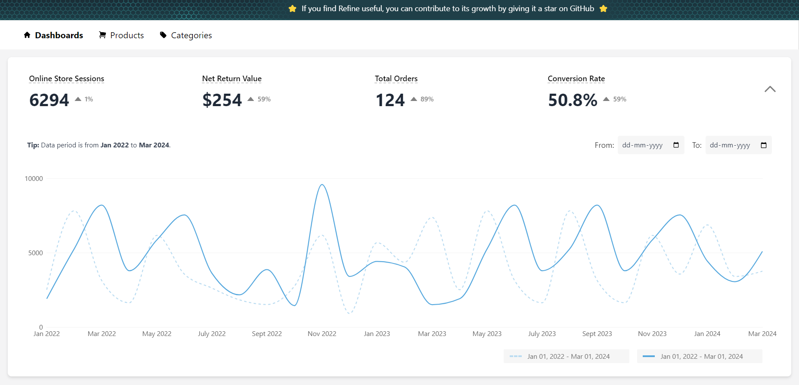

# MarbleAI Assessment

## Description
In this React project, built upon the Refine-DaisyUI framework:

- Implemented Line Charts using the Rechart library.
- Incorporated Skeleton components to enhance user experience during data fetching.
- Integrated Date Range Picker functionality for enhanced user interaction.
- Achieved nearly complete replication of the Figma design into code.   

## Assessment Screenshots

<div style="display: flex; justify-content: space-around;">
  <div>
    <h3>Loading Skeleton</h3>
    
  </div>
  <div>
    <h3>Dashboard</h3>
    
  </div>
</div>

## Installation

To run the application locally, follow these steps:

1. Clone the repository:

   ```bash
   git clone https://github.com/MYSTYX7/blog-refine-daisyui.git
   ```

2. Navigate to the project directory:

   ```bash
   cd blog-refine-daisyui
   ```

3. Install dependencies using npm:

   ```bash
   pnpm install
   ```

4. Start the development server:

   ```bash
   pnpm run dev
   ```

5. Open your browser and visit `http://127.0.0.1:5173/` to view the application.
